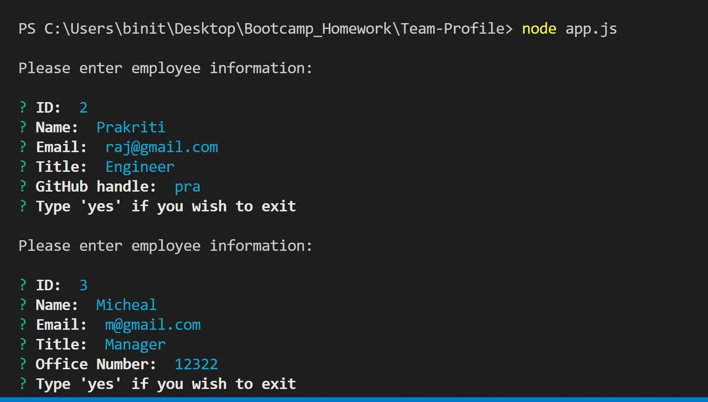

# Team Profile Generator

A software engineering team generator command line application

## Table of Contents

1. [About](#about)
1. [User Input](#user-input)
1. [Output](#output)
1. [Screenshots](#Screenshots)
1. [Demo](#demo)

## About

Employee Summary application prompts the user for information about the team manager and then information about the team members. As a user, you can input any number of team members, and they may be a mix of engineers and interns. Once all the team members are logged, the application will create an HTML file that displays a nicely formatted team roster based on the information provided by the user.

### User Input

The project must prompt the user to build an engineering team. An engineering
team consists of a manager, and any number of engineers and interns.

### Output

The project must generate a `team.html` page in the `output` directory, that displays a nicely formatted team roster. Each team member should display the following in no particular order:

- Name

- Role

- ID

- Role-specific property (School, link to GitHub profile, or office number)

### Screenshots

### Demo

Deployed Application :
